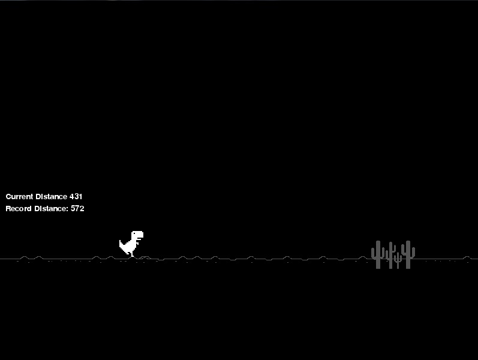

<h1 >
    T-Rex Game
</h1>
<p >
    Chrome T-Rex's clone.
</p>


<h1 align="center">
    
   
</h1>
<p align="center" target="_blank">
    Made with 💜 by Vinicius Jose
</p>

# Description

The project was a recreated and altered version of the famous Chrome T-Rex game made in Python 3.


# Technology

Built using **pygame** library.

# Executable

Inside the build folder is the project's executable, you can run it even if you don't have python or pygame installed on your device, it's naming it **main.exe**.


# Instructions and Prerequisites:

- To run this game:

- Make sure you have Python installed alongwith pygame (http://www.pygame.org/) library Run main.py


if you don't have pygame installed, run the command on the terminal
```python
    $ pip install -U pygame
```
- clone the repository
```bash
    $ git clone https://github.com/zV1N1/pygame-dino.git
```


# Controls

- Press UP to make T-Rex jump over the obstacles
- Press SPACE to airplane.
- Avoid getting hit by obstacles.

---

<h4 align="center"> <em>&lt;/&gt;</em> by <a href="https://github.com/zV1N1" target="_blank">zV1N1</a> </h4>
